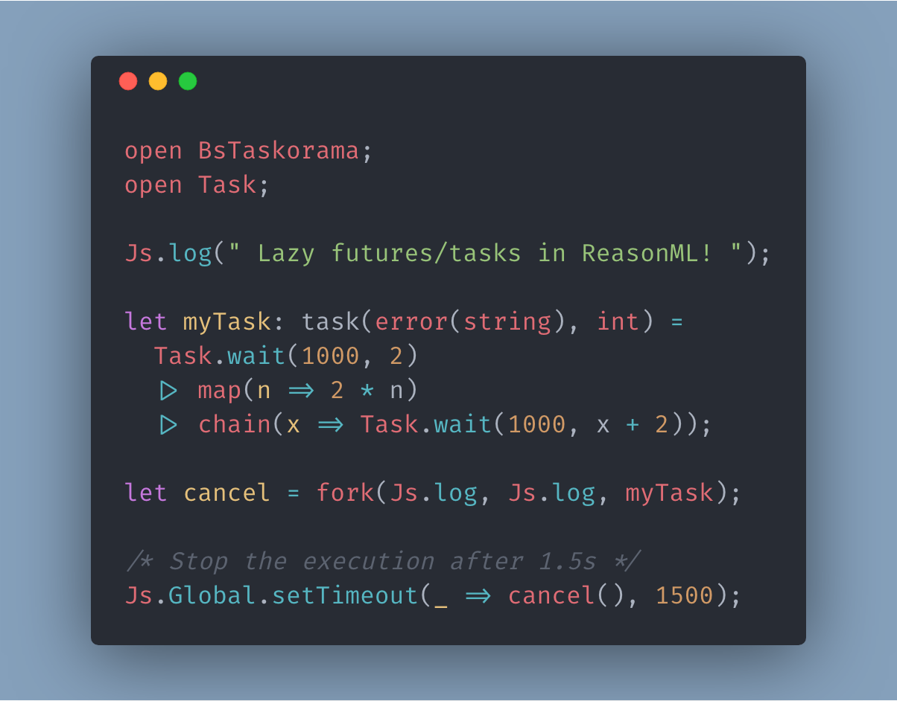

# bs-taskorama

bs-taskorama is a port of [Taskorama](https://github.com/YannickDot/Taskorama) to ReasonML.



## Install

yarn:

```
yarn add bs-taskorama
```

npm:

```
npm install bs-taskorama
```

Add `bs-taskorama` to `bs-dependencies` in your bsconfig.json.
